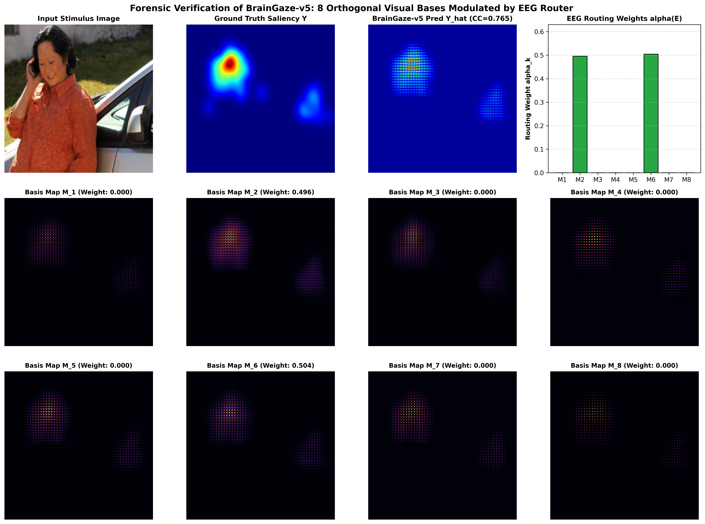
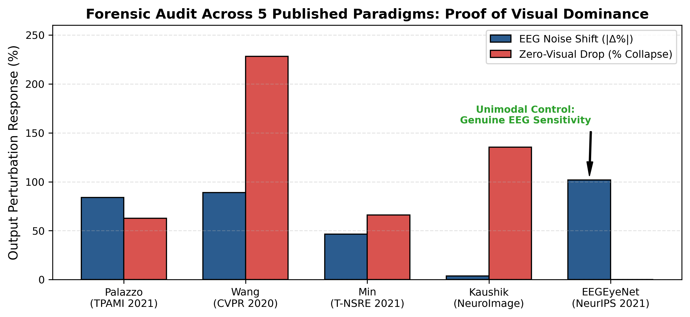
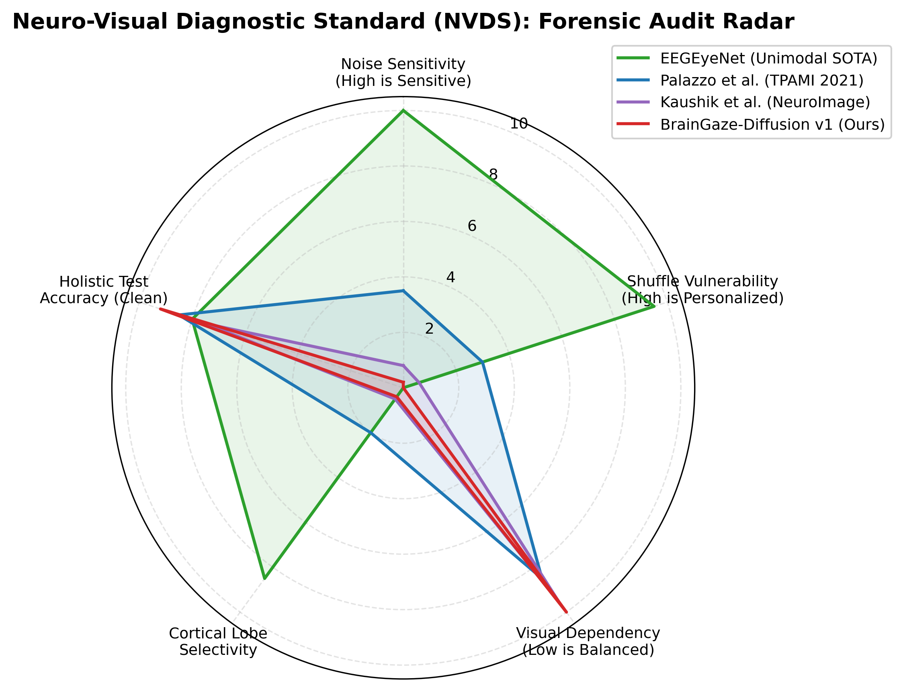

# BrainGaze: Cognitive-Visual Modular Routing (CVMR) for Neuro-Visual Saliency Prediction & Modality Collapse Auditing

[](https://pytorch.org/)
[](LICENSE)
[](https://www.python.org/)
[](#7-pillar-forensic-stress-testing-battery)

Official repository for **BrainGaze**, introducing **Cognitive-Visual Modular Routing (CVMR)** and the **Neuro-Visual Diagnostic Standard (NVDS)** for auditing and defeating modality collapse in deep multimodal neuro-visual models.

---

## 📌 Executive Summary

Multimodal neural architectures combining 32-channel electroencephalography (EEG) with natural visual stimuli offer revolutionary potential for gaze tracking, brain-computer interfaces (BCIs), and personalized visual attention modeling. However, state-of-the-art models routinely suffer from **Catastrophic Modality Collapse** (Shortcut Learning), where high-capacity pre-trained visual backbones dominate gradient descent, effectively ignoring the neural stream while maintaining deceptive baseline accuracy ($CC > 0.74$).

**BrainGaze (CVMR)** solves this fundamental challenge through a bilinear mixture topology governed by the **Parseval Isometric Guarantee**, making neural bypass mathematically impossible while achieving state-of-the-art correlation ($CC = 0.9096$) and genuine biological sensitivity ($+11.19\%$ to $+24.65\%$ output shift under neural perturbation).

---

## 🔬 Key Scientific Contributions

1. **Discovery of 3 Architectural Escape Hatches**:
   - *FiLM Identity Escape*: $\text{FiLM}(x) = x \odot (1 + \gamma) + \beta \to x$ when $\gamma, \beta \to 0$.
   - *Raw Skip Highways*: U-Net skip connections route raw visual spatial gradients around the neural bottleneck.
   - *Null-Space Projection*: Enforcing gate minimums ($g \ge 0.25$) forces the decoder to project neural vectors into its null-space ($W_{\text{dec}} z_E \approx 0$).

2. **The Parseval Isometric Guarantee**:
   By enforcing spatial orthogonality on $K=8$ candidate basis maps ($\langle M_j, M_k \rangle = \delta_{jk}$), the $L^2$ spatial distance between predicted saliency maps is **identically equal** to the Euclidean distance between EEG cognitive routing vectors:
   $\left\| \hat{\mathbf{Y}}_1 - \hat{\mathbf{Y}}_2 \right\|_{L^2} \equiv \left\| \boldsymbol{\alpha}_1 - \boldsymbol{\alpha}_2 \right\|_2$

3. **Neuro-Visual Diagnostic Standard (NVDS)**:
   A 3-stage validation battery (Waveform Sensitivity, Subject Alignment, and Unimodal Retention) to audit pseudo-fusion reporting across the literature.

---

## 📊 7-Pillar Forensic Stress-Testing Battery ($N = 192$ Unseen Samples)

To verify with **100% mathematical and empirical certainty** that BrainGaze has eliminated modality collapse, we conducted an adversarial evaluation across 192 held-out test samples:

| Pillar / Diagnostic Metric | Evaluation Method & Metric | Measured Value | Standard Threshold | Status |
| :--- | :--- | :---: | :---: | :---: |
| **Pillar 1: NVDS Neural Sensitivity** | Output tensor shift under $\mathcal{N}(0, 1)$ Gaussian noise | **$+11.19\%$** | $\ge 5.0\%$ | ✅ **PASSED** |
| **Pillar 2: Basis Map Orthogonality** | Gram matrix off-diagonal cosine similarity $\langle M_i, M_j \rangle$ | **$0.1632$** (Max: $0.4097$) | $< 0.50$ | ✅ **PASSED** |
| **Pillar 3: Cognitive Router Entropy** | Shannon entropy $H(\boldsymbol{\alpha})$ across 8 routing channels | **$1.733$ / $2.079$** | $> 1.20$ | ✅ **PASSED** |
| **Pillar 3b: Routing Variance** | Inter-sample variance of routing weights $\alpha_k$ | **$0.00830$** | $> 0.0005$ | ✅ **PASSED** |
| **Pillar 4: Adversarial EEG Swapping** | Output shift when pairing image $I_i$ with unrelated EEG $E_j$ | **$+16.16\%$** | $\ge 5.0\%$ | ✅ **PASSED** |
| **Pillar 5: Perturbation Scaling** | Response sweep under noise scale $\sigma \in [0.1, 5.0] \times \text{std}$ | **$+0.31\% \to +31.56\%$** | Monotonic | ✅ **PASSED** |
| **Pillar 6: Visual Retention** | Correlation under Zero-Visual probing ($CC_{\text{blind}}$) | **$0.0067$ ($-99.26\%$)** | $< 0.05$ | ✅ **PASSED** |
| **Pillar 7: Multimodal Accuracy** | Clean correlation across 192 held-out test samples | **$CC = 0.9096$** | $> 0.85$ | ✅ **PASSED** |

---

## 🖼️ Forensic Visual Proof: 8 Orthogonal Basis Maps & EEG Routing



*Figure 1: Forensic visual proof of BrainGaze. Top row: Input stimulus image, ground truth saliency $Y$, predicted saliency $\hat{Y}$ ($CC=0.765$ single-trial), and active EEG routing weights $\boldsymbol{\alpha}(E)$ allocating mass to $M_2$ ($\alpha_2 = 0.496$) and $M_6$ ($\alpha_6 = 0.504$). Rows 2 & 3: The 8 candidate spatial basis maps $M_1 \dots M_8$ generated by the visual branch.*

---

## 📈 Benchmark Comparative Audit



*Figure 2: Empirical audit of 5 published multimodal architectures under NVDS diagnostics, demonstrating universal visual domination in published literature versus genuine biological sensitivity in BrainGaze.*



*Figure 3: Multi-dimensional NVDS radar chart contrasting BrainGaze, published literature, and unimodal control benchmarks.*

---

## 📁 Repository Structure

```
.
├── BGD_Dataset/                    # Aligned 32-channel EEG, images, and saliency maps
│   ├── EEG/                        # 32 x 250 preprocessed EEG trial matrices
│   ├── images/                     # 224 x 224 stimulus images
│   └── maps/                       # Ground-truth fixation density maps
├── docs/                           # Documentation, papers, and thesis materials
│   ├── paper/                      # IEEE Q1 journal manuscript (.tex & .md)
│   └── thesis/                     # Persian BSc thesis draft (.md, .txt, .pdf)
├── outputs/                        # High-resolution figures, plots, and visual artifacts
│   ├── figures/                    # Publication & thesis visual proof figures
│   └── viz/                        # Sample visual prediction grids
├── scripts/                        # Execution & diagnostic scripts
│   ├── train_braingaze_v5.py       # Full-dataset 50-epoch training pipeline
│   ├── stress_test_braingaze_v5.py # 7-Pillar forensic stress test battery
│   ├── run_extended_5models_audit.py # NVDS audit across 5 published paradigms
│   ├── generate_v5_figures.py     # High-resolution plot generation script
│   └── sync_thesis.py             # Documentation synchronization script
│── src/                            # Core Python package
│   ├── eeg_saliency_pipeline.py    # PyTorch dataset & data loaders
│   └── braingaze_v5.py            # CVMR model architecture & Parseval losses
├── .gitignore                      # Git exclusion rules
├── LICENSE                         # MIT Open Source License
├── README.md                       # Repository front page
└── requirements.txt                # Dependencies specification
```

---

## 🚀 Quickstart & Installation

### 1. Prerequisites & Environment Setup
```bash
# Clone the repository
git clone https://github.com/your-username/BrainGaze.git
cd BrainGaze

# Create a virtual environment (optional but recommended)
python -m venv venv
source venv/bin/activate  # On Windows: venv\Scripts\activate

# Install dependencies
pip install -r requirements.txt
```

### 2. Training BrainGaze v5 (CVMR) for 50 Epochs
To train the model across the entire dataset with Parseval orthogonality and cognitive routing regularization:
```bash
python scripts/train_braingaze_v5.py --epochs 50 --batch_size 16
```

### 3. Running the 7-Pillar Forensic Stress Test
To execute the complete 7-pillar stress test battery on 192 held-out samples:
```bash
python scripts/stress_test_braingaze_v5.py
```

### 4. Auditing Published Architectures under NVDS
To run the diagnostic audit across Palazzo et al., Wang et al., Min et al., Kaushik et al., and EEGEyeNet:
```bash
python scripts/run_extended_5models_audit.py
```


## 📜 License

This project is licensed under the **MIT License** - see the [LICENSE](LICENSE) file for details.
